# Sean Hand-Drawn Illustration Skill

Two Codex skills for generating white-background, literary magazine cover style hand-drawn illustrations from a topic.

这是一组 Codex skill，用来把一个主题转译成白底、文学杂志封面感、主观地理式的手绘插画。

## Skills

| Skill | Folder | Language |
|---|---|---|
| Sean 手绘插画 | `sean-hand-drawn-illustration-zh/` | 中文 |
| Sean Hand-Drawn Illustration | `sean-hand-drawn-illustration-en/` | English |

Both versions follow the same core logic. The Chinese version was tested first, then the English version was synchronized from the validated Chinese version.

中英文版本使用同一套核心逻辑。中文版先完成测试，英文版根据已验证的中文版同步更新。

## What It Does

The skill turns a topic into a subjective geography illustration:

这个 skill 会把主题转译成一种“主观地理”插画：

- Near field: what the observer directly sees, experiences, and feels.
- Middle field: the cognitive boundary between familiar life and a half-understood system.
- Visible entrance layer: products, platforms, institutions, people, or systems the observer knows by name but does not fully understand.
- Far background layer: infrastructure, capital, rules, disputes, macro narratives, or distant imagined futures.

- 近处：观察主体真正看清、真正经历、真正有体感的东西。
- 中部：从熟悉生活进入半懂不懂系统的认知边界。
- 可见入口层：观察主体知道名字、见过或使用过，但不真正理解的产品、平台、机构、人物或系统。
- 远方幕后层：基础设施、资本、规则、路线争议、宏大叙事或遥远想象。

The visual style is white paper, black / gray pencil linework, sparse colored-pencil accents, and a literary editorial cover title.

视觉风格是白纸底、黑灰铅笔线稿、少量彩铅锚点，以及文学杂志封面感的大标题。

## Tested Environment

These skills were tested in the Codex app using Codex's built-in image generation workflow.

这些 skill 是在 Codex app 内置图片生成流程中测试的。

The exact image backend may vary by product environment. In my tests, the workflow behaved like OpenAI's current image generation experience often referred to as `image-2`, but this repository does not require a hard-coded model name. If your Codex or ChatGPT environment exposes a different image model, use the same skill instructions with that available image-generation tool.

不同产品环境里的底层图片模型可能会变化。我的测试环境表现接近 OpenAI 当前图片生成体验中常被称为 `image-2` 的流程，但本仓库不把某个模型名写成硬依赖。如果你的 Codex 或 ChatGPT 环境暴露的是其他图片生成模型，可以继续使用同一份 skill 指令。

## Installation

Copy the skill folder you want into your Codex skills directory.

把你想使用的 skill 文件夹复制到 Codex skills 目录。

Chinese:

```bash
mkdir -p "$HOME/.codex/skills/sean-hand-drawn-illustration-zh"
cp sean-hand-drawn-illustration-zh/SKILL.md "$HOME/.codex/skills/sean-hand-drawn-illustration-zh/SKILL.md"
```

English:

```bash
mkdir -p "$HOME/.codex/skills/sean-hand-drawn-illustration-en"
cp sean-hand-drawn-illustration-en/SKILL.md "$HOME/.codex/skills/sean-hand-drawn-illustration-en/SKILL.md"
```

Restart Codex after installing or updating a skill.

安装或更新 skill 后，需要重启 Codex。

## Inputs

Required:

必填：

```text
Topic / 主题: [one-sentence topic / 一句话主题]
```

Optional:

可选：

```text
Observer / 观察主体: [who is looking at this world / 谁在看这个世界]
Contrast / 想表达的反差: [what is clear nearby, what is vague far away / 近处清楚什么，远处模糊什么]
Use / 输出用途: [social cover, article image, magazine cover, poster / 小红书封面、文章配图、杂志封面、海报]
Required text / 必须出现的文字: [title and a few map place names / 标题和少量地图地名]
Avoid / 必须避免的内容: [elements, styles, colors, or content to avoid / 不想出现的元素、风格、颜色]
Aspect ratio / 画面比例: [4:5, 3:4, 16:9, etc.]
```

In my tests, I usually provided only the topic and aspect ratio. A topic alone also works; the skill will infer the observer, era, contrast, and spatial structure.

我的测试通常只提供主题和画面比例。只给主题也可以，skill 会自行推断观察主体、年代、反差和空间结构。

## Default Workflow

By default, the skill internally completes Part A-D, then uses Part D to generate the image directly.

默认情况下，skill 会在内部完成 Part A-D，然后直接用 Part D 生成图片。

```text
Part A: Topic Analysis
Part B: Spatial Tradeoff Table
Part C: Keep/Delete List + Plan Review
Part D: Final Image-Generation Prompt
```

```text
Part A：主题分析
Part B：空间取舍表
Part C：保留 / 删除清单 + 方案预检
Part D：最终图片生成 Prompt
```

Part C is a pre-prompt plan review. It reviews the plan already established in Part A and Part B; it does not inspect the not-yet-written Part D prompt text.

Part C 是写 Part D 前的方案预检。它检查 Part A 和 Part B 已经确定的方案，不检查尚未写出的 Part D 原文。

## Usage Examples

Default direct generation:

默认直接生成图片：

```text
Use Sean Hand-Drawn Illustration to generate an image.
Topic: The subscription life
Aspect ratio: 4:5
```

```text
用 Sean 手绘插画生成图片。
主题：订阅制人生
画面比例：4:5
```

Ask to review Part A-D before generation:

先看 Part A-D，确认后再生成图：

```text
Use Sean Hand-Drawn Illustration.
First output Part A, Part B, Part C, and Part D. Wait for my confirmation before generating the image.
Topic: The large-model war as seen by ordinary people
Aspect ratio: 4:5
```

```text
用 Sean 手绘插画。
先输出 Part A、Part B、Part C 和 Part D，等我确认后再生成图片。
主题：普通人眼中的大模型战争
画面比例：4:5
```

Ask to show the materials after generation:

生成后查看本次使用的材料：

```text
Show me the Part A-D used for this image.
```

```text
给我看这张图使用的 Part A-D。
```

Some image-generation runtimes do not allow follow-up text immediately after image generation. In that case, ask for Part A-D in a later message.

有些图片生成环境在生成图片后不允许立刻继续发送文字。这种情况下，可以在后续消息里再要求查看 Part A-D。

## Example Images

Example images generated during testing:

以下是测试过程中生成的示例图片：

Chinese examples:

中文示例：

| 订阅制人生 | 大模型战争 |
|---|---|
| 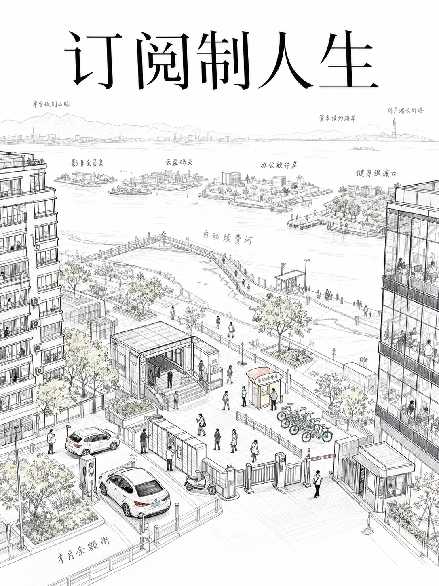 | 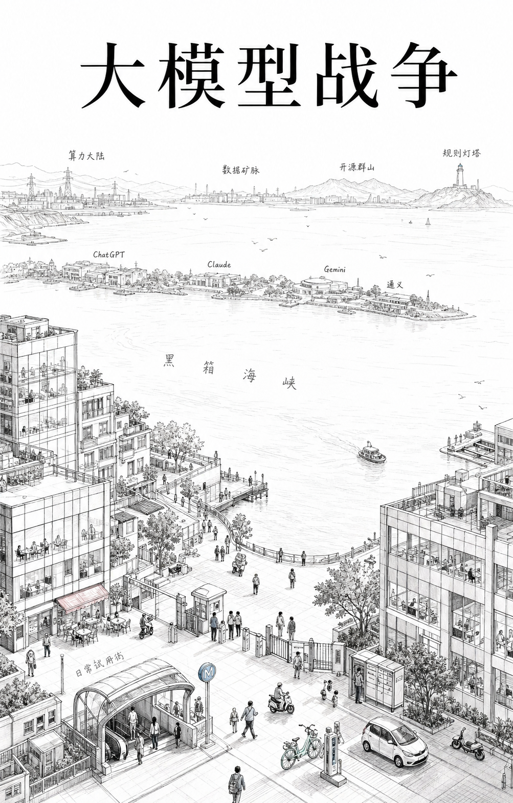 |

| 一顿晚饭的宇宙 | 建造金字塔的人 |
|---|---|
| 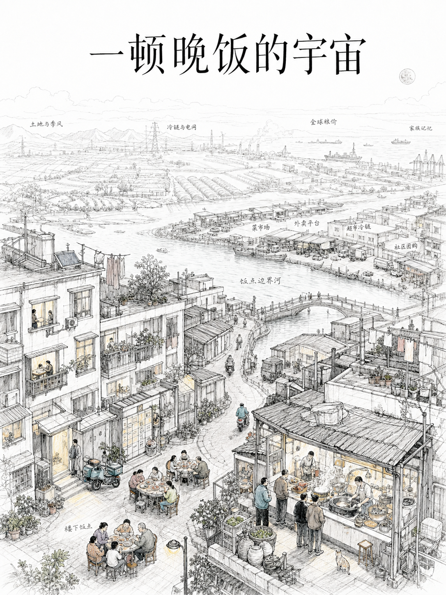 | 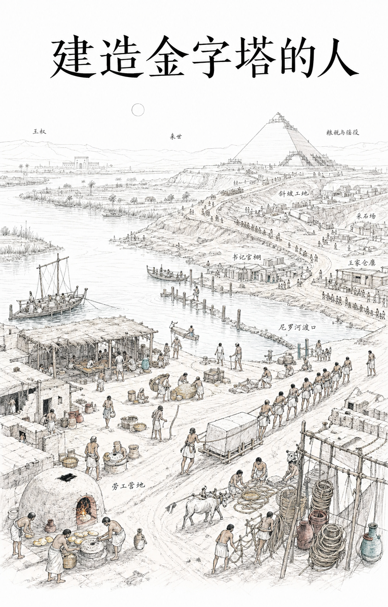 |

| 诸葛亮的世界 | 爱因斯坦的物理 |
|---|---|
| 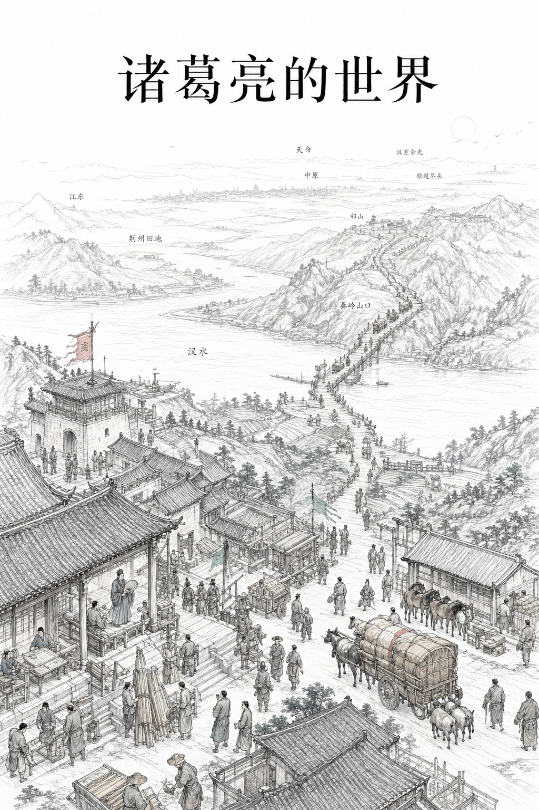 | 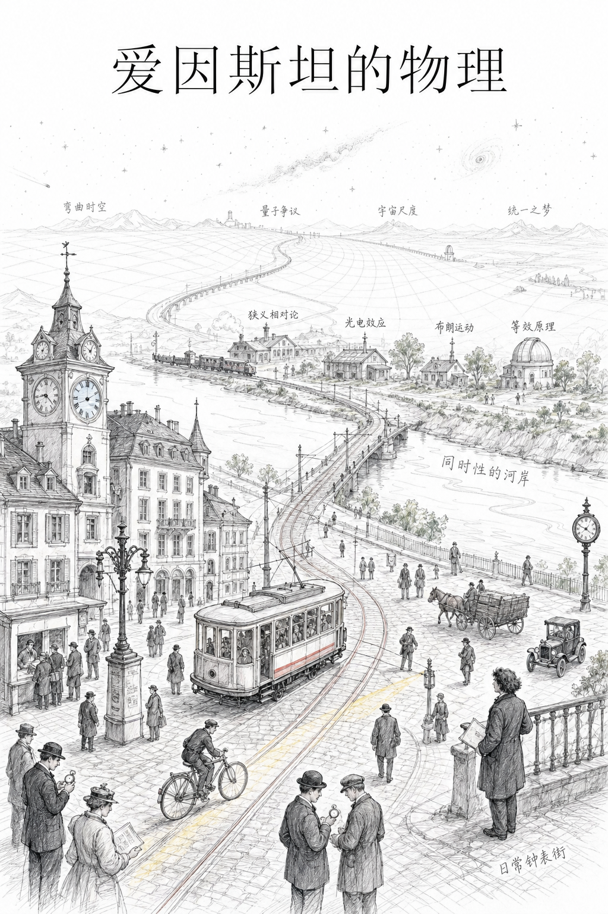 |

English examples:

英文示例：

| Subscription Life | Large-Model War |
|---|---|
| 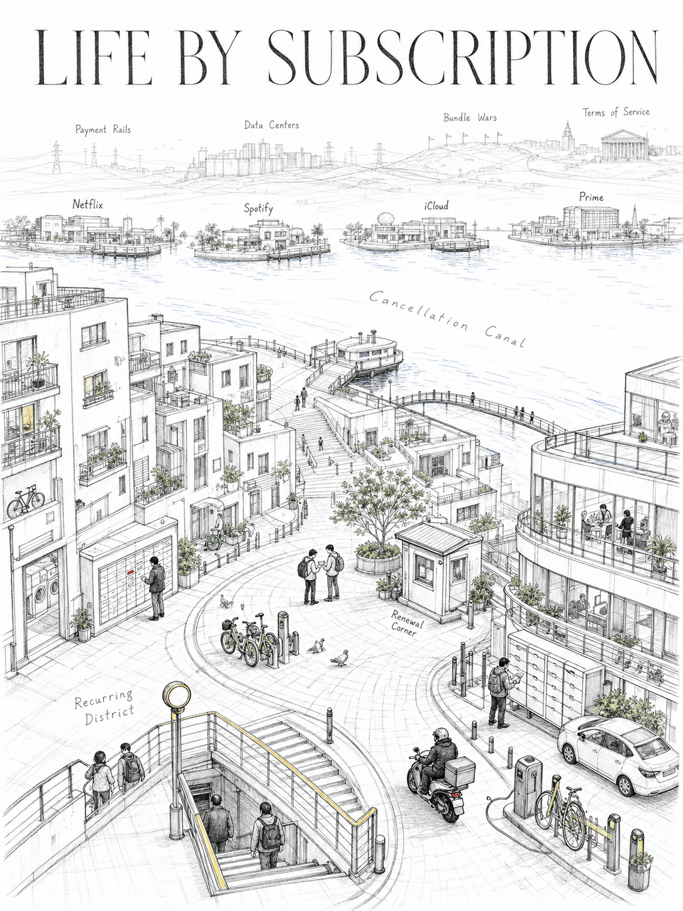 | 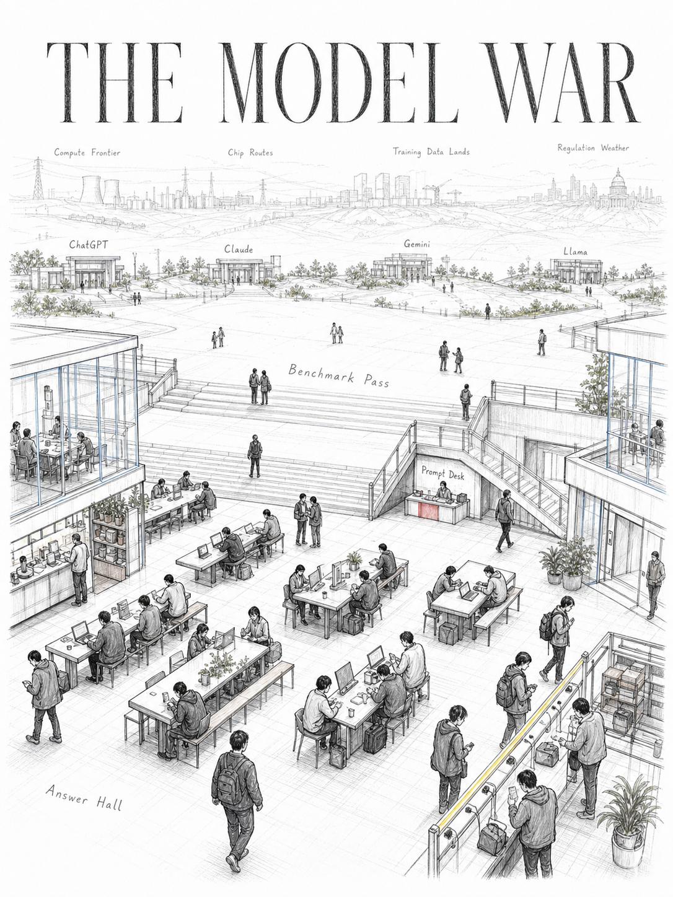 |

| The Universe of a Dinner | The People Who Built the Pyramids |
|---|---|
| 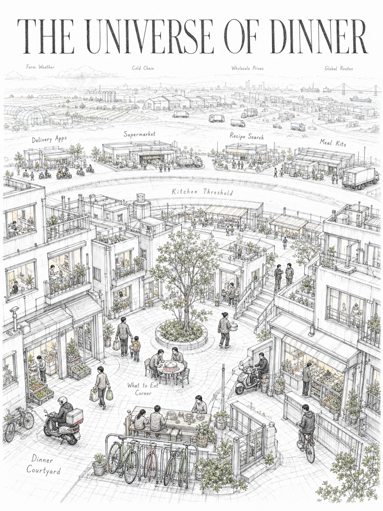 | 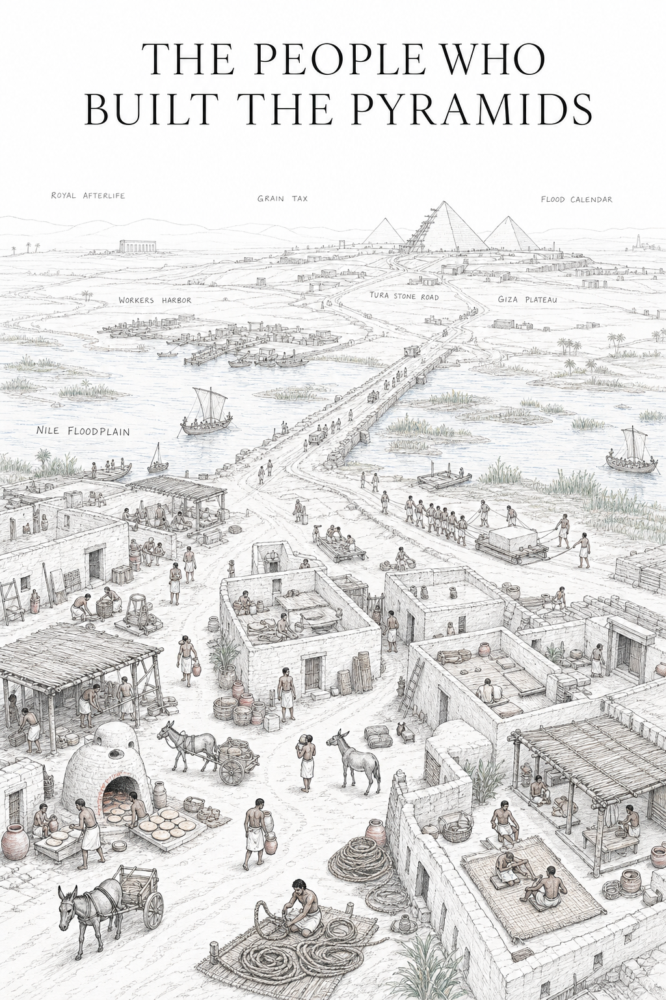 |

| Zhuge Liang's World | Einstein's Physics |
|---|---|
| 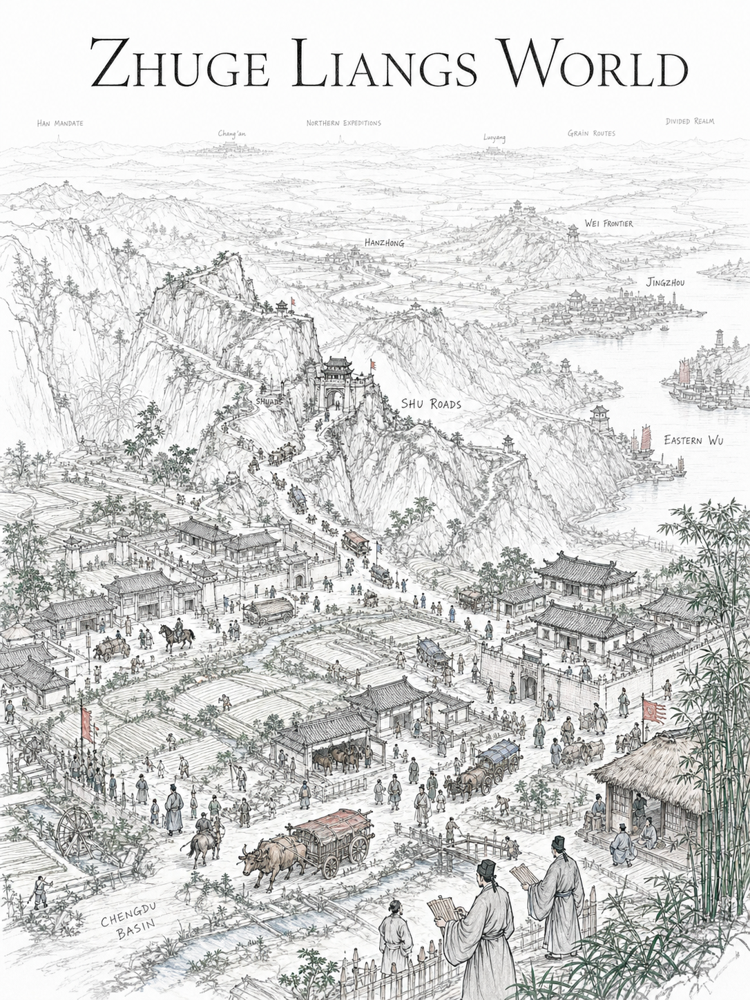 | 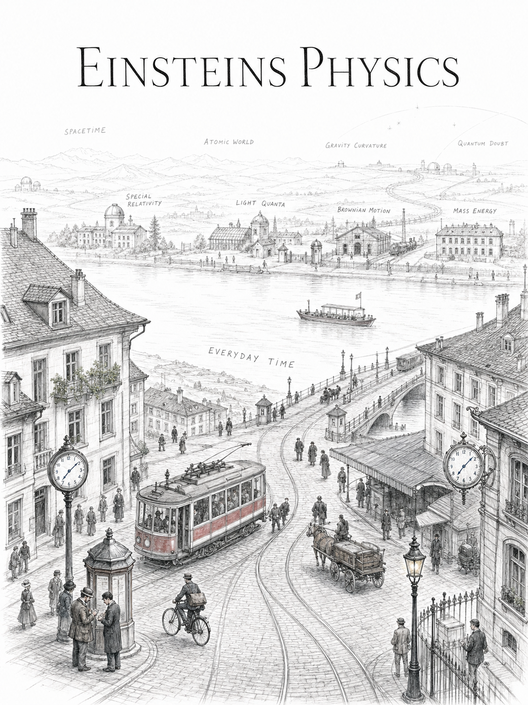 |

Example images were generated during testing with Codex's built-in image generation workflow.

示例图片是在测试过程中使用 Codex 内置图片生成流程生成的。

Example images are AI-generated test outputs and are included only to demonstrate skill behavior. They are not official artwork or brand assets.

示例图片为 AI 生成的测试输出，仅用于展示 skill 效果，不代表任何官方作品或品牌资产。

## Design Guardrails

The current version includes guardrails for:

当前版本包含这些关键约束：

- Pure white background, not gray wash, beige paper, parchment, or vintage filters.
- Pale gray pencil linework is allowed for distance, contours, water texture, and spatial continuity.
- Concrete era evidence must be chosen; avoid generic modernity or generic historicity.
- A composition skeleton and viewpoint must be selected before writing the final prompt.
- Avoid repeating the same "left-right foreground buildings + central road or river + far-shore entrances + distant horizon" template unless it is truly the best choice.
- Keep wall text, callouts, UI panels, menus, price lists, rankings, and brand relationship diagrams out of the image.

- 必须是纯白背景，不能是灰底、米黄纸、羊皮纸或复古滤镜。
- 允许浅灰铅笔线稿表达远方、轮廓、水纹和空间连续性。
- 必须选择具体年代证据，避免泛现代或泛历史。
- 写最终 prompt 前，必须先选择构图骨架和视角。
- 除非确实最适合主题，否则避免重复“左右前景建筑 + 中央道路 / 河流 + 远岸入口 + 远方地平线”模板。
- 避免墙面文字、图注线、UI 面板、菜单、价格表、排行榜和品牌关系图。

## Notes

These skills are prompt and workflow documents, not deterministic renderers. Results depend on the image model, runtime, prompt interpretation, and session context.

这些 skill 是 prompt 和工作流文档，不是确定性渲染器。最终效果会受到图片模型、运行环境、prompt 理解和会话上下文影响。

For testing, both same-conversation and fresh-conversation workflows are useful:

测试时，同窗口和新窗口都可以：

- Same conversation: works well in my tests. I tested three modern topics in one conversation without obvious template repetition.
- Fresh conversation: useful when you want to reduce session carryover, or if several consecutive images start to look too similar.

- 同窗口：我的测试中表现正常。我连续测试过 3 个现代主题，没有明显模板重复。
- 新窗口：如果你想减少会话惯性，或者连续几张图开始变得相似，可以新开窗口。

## License

MIT License.

You may use, copy, modify, publish, distribute, sublicense, and/or sell copies of this project, as long as the copyright notice and license text are included.

MIT 许可证。

你可以使用、复制、修改、发布、分发、再授权或商业使用本项目，但需要保留版权声明和许可证文本。
